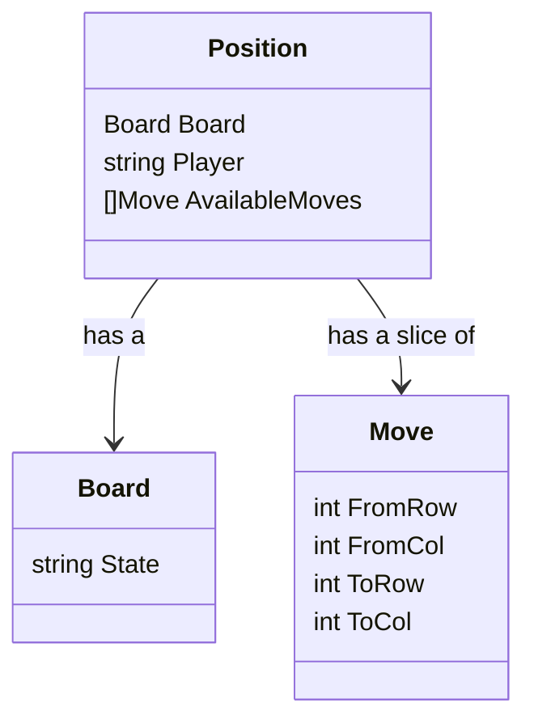

# Machine learning with matchboxes: project notes

## Data structures

### Initial thoughts (May 2024)

We need a data structure that defines a board position and a way to describe a move. We'll have a map where for each board position we'll have a list of possible moves.

A board position is encoded as a string of form: `www...bbb` where `w` and `b` are white and black pawns, and `.` are empty squares.

A move is encoded by an `int` slice of form `{2, 5}` which means that the white pawn in the middle of the bottom row moves one square up to the middle of the middle row. In this case, we use human-friendly numbering that starts from 1.

Another way to encode moves is to define the position _after_ the move, assuming that all moves are applied to a certain position. This one is a bit harder to encode without making mistakes, but it will be easier to use in the program.

Let's see which one is better. Probably for this 3x3 board, it's easier to encode the positions for each move. If we are going to expand the game to 4x4 or more, it will be better to generate moves according to the rules and generate end positions for each move programmatically.

### June 2024

New data structures (implemented and planned). Let's go from the bottom.

A Move is a four-integer struct with From and To positions represented as row-column pairs. There is a string (human-readable) representation of a Move in the form of `a1-a2`.

A Position includes a Board represented as a string (`WWW...BBB`), a Player whose move is next, and a slice of Moves available in this position.

A Step is a numbered stage in the game (what we usually call a move, as in "at the 5th move the white captured the black Knight at f4", but the Move type is already taken). We have a slice of Steps (they are numbered as Step 1, Step 2, etc.), where each Step includes:

- The player whose move is next
- A map of Positions where for each board string we have a slice of available moves in this Position.

This is what we draw on the tops of matchboxes.

This structure is used when we train the machine. We remove "bad" moves from the structure and save it as JSON (or similar), and that JSON now represents a "trained" machine (after a number of games).

Here is a diagram created with Mermaid.

So we need a GenerateSteps function that will produce a data structure equivalent to the diagrams for matchboxes.
